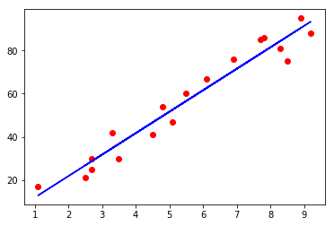
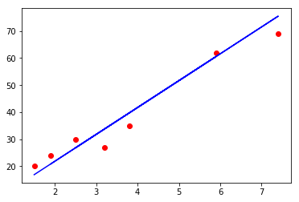

# Simple Linear Regression(简单线性回归模型)

## Step 1: Data Preprocessing(数据预处理)


```python
import pandas as pd
import numpy as np
import matplotlib.pyplot as plt

dataset = pd.read_csv('studentscores.csv')
dataset
```


<div>
<style scoped>
    .dataframe tbody tr th:only-of-type {
        vertical-align: middle;
    }

    .dataframe tbody tr th {
        vertical-align: top;
    }

    .dataframe thead th {
        text-align: right;
    }
</style>
<table border="1" class="dataframe">
  <thead>
    <tr style="text-align: right;">
      <th></th>
      <th>Hours</th>
      <th>Scores</th>
    </tr>
  </thead>
  <tbody>
    <tr>
      <th>0</th>
      <td>2.5</td>
      <td>21</td>
    </tr>
    <tr>
      <th>1</th>
      <td>5.1</td>
      <td>47</td>
    </tr>
    <tr>
      <th>2</th>
      <td>3.2</td>
      <td>27</td>
    </tr>
    <tr>
      <th>3</th>
      <td>8.5</td>
      <td>75</td>
    </tr>
    <tr>
      <th>4</th>
      <td>3.5</td>
      <td>30</td>
    </tr>
    <tr>
      <th>5</th>
      <td>1.5</td>
      <td>20</td>
    </tr>
    <tr>
      <th>6</th>
      <td>9.2</td>
      <td>88</td>
    </tr>
    <tr>
      <th>7</th>
      <td>5.5</td>
      <td>60</td>
    </tr>
    <tr>
      <th>8</th>
      <td>8.3</td>
      <td>81</td>
    </tr>
    <tr>
      <th>9</th>
      <td>2.7</td>
      <td>25</td>
    </tr>
    <tr>
      <th>10</th>
      <td>7.7</td>
      <td>85</td>
    </tr>
    <tr>
      <th>11</th>
      <td>5.9</td>
      <td>62</td>
    </tr>
    <tr>
      <th>12</th>
      <td>4.5</td>
      <td>41</td>
    </tr>
    <tr>
      <th>13</th>
      <td>3.3</td>
      <td>42</td>
    </tr>
    <tr>
      <th>14</th>
      <td>1.1</td>
      <td>17</td>
    </tr>
    <tr>
      <th>15</th>
      <td>8.9</td>
      <td>95</td>
    </tr>
    <tr>
      <th>16</th>
      <td>2.5</td>
      <td>30</td>
    </tr>
    <tr>
      <th>17</th>
      <td>1.9</td>
      <td>24</td>
    </tr>
    <tr>
      <th>18</th>
      <td>6.1</td>
      <td>67</td>
    </tr>
    <tr>
      <th>19</th>
      <td>7.4</td>
      <td>69</td>
    </tr>
    <tr>
      <th>20</th>
      <td>2.7</td>
      <td>30</td>
    </tr>
    <tr>
      <th>21</th>
      <td>4.8</td>
      <td>54</td>
    </tr>
    <tr>
      <th>22</th>
      <td>3.8</td>
      <td>35</td>
    </tr>
    <tr>
      <th>23</th>
      <td>6.9</td>
      <td>76</td>
    </tr>
    <tr>
      <th>24</th>
      <td>7.8</td>
      <td>86</td>
    </tr>
  </tbody>
</table>
</div>


```python
X = dataset.iloc[:,:1].values
Y = dataset.iloc[:,1].values
X,Y
```


    (array([[2.5],
            [5.1],
            [3.2],
            [8.5],
            [3.5],
            [1.5],
            [9.2],
            [5.5],
            [8.3],
            [2.7],
            [7.7],
            [5.9],
            [4.5],
            [3.3],
            [1.1],
            [8.9],
            [2.5],
            [1.9],
            [6.1],
            [7.4],
            [2.7],
            [4.8],
            [3.8],
            [6.9],
            [7.8]]),
     array([21, 47, 27, 75, 30, 20, 88, 60, 81, 25, 85, 62, 41, 42, 17, 95, 30,
            24, 67, 69, 30, 54, 35, 76, 86], dtype=int64))


```python
from sklearn.model_selection import train_test_split
X_train, X_test, Y_train, Y_test = train_test_split(X, Y, test_size=1/4, random_state=0)
X_train, X_test, Y_train, Y_test
```


    (array([[7.8],
            [6.9],
            [1.1],
            [5.1],
            [7.7],
            [3.3],
            [8.3],
            [9.2],
            [6.1],
            [3.5],
            [2.7],
            [5.5],
            [2.7],
            [8.5],
            [2.5],
            [4.8],
            [8.9],
            [4.5]]), array([[1.5],
            [3.2],
            [7.4],
            [2.5],
            [5.9],
            [3.8],
            [1.9]]), array([86, 76, 17, 47, 85, 42, 81, 88, 67, 30, 25, 60, 30, 75, 21, 54, 95,
            41], dtype=int64), array([20, 27, 69, 30, 62, 35, 24], dtype=int64))


## Step 2: Fitting Simple Linear Regression Model to the training set(训练集使用简单线性回归模型来训练)


```python
from sklearn.linear_model import LinearRegression
regressor = LinearRegression()
regressor = regressor.fit(X_train, Y_train)
regressor
```


    LinearRegression(copy_X=True, fit_intercept=True, n_jobs=None,
             normalize=False)


## Step 3: Predecting the Result(预测结果)


```python
Y_pred = regressor.predict(X_test)
Y_pred
```


    array([16.84472176, 33.74557494, 75.50062397, 26.7864001 , 60.58810646,
           39.71058194, 20.8213931 ])


## Step 4: Visualization(可视化)

### Visualising the Training results(训练集结果可视化)


```python
plt.scatter(X_train, Y_train, color='red')
plt.plot(X_train, regressor.predict(X_train), color='blue')
plt.show()
```





### Visualizing the test results(测试集结果可视化)


```python
plt.scatter(X_test, Y_test,color='red')
plt.plot(X_test, regressor.predict(X_test), color='blue')
plt.show()
```




