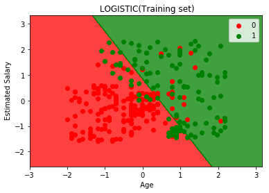
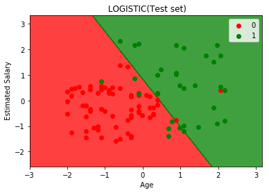

# Logistic Regression

## Step 1 | Data Pre-Processing(数据预处理)


```python
import numpy as np
import matplotlib.pyplot as plt
import pandas as pd
dataset = pd.read_csv('Social_Network_Ads.csv')
dataset
```


<div>
<style scoped>
    .dataframe tbody tr th:only-of-type {
        vertical-align: middle;
    }

    .dataframe tbody tr th {
        vertical-align: top;
    }

    .dataframe thead th {
        text-align: right;
    }
</style>
<table border="1" class="dataframe">
  <thead>
    <tr style="text-align: right;">
      <th></th>
      <th>User ID</th>
      <th>Gender</th>
      <th>Age</th>
      <th>EstimatedSalary</th>
      <th>Purchased</th>
    </tr>
  </thead>
  <tbody>
    <tr>
      <th>0</th>
      <td>15624510</td>
      <td>Male</td>
      <td>19</td>
      <td>19000</td>
      <td>0</td>
    </tr>
    <tr>
      <th>1</th>
      <td>15810944</td>
      <td>Male</td>
      <td>35</td>
      <td>20000</td>
      <td>0</td>
    </tr>
    <tr>
      <th>2</th>
      <td>15668575</td>
      <td>Female</td>
      <td>26</td>
      <td>43000</td>
      <td>0</td>
    </tr>
    <tr>
      <th>3</th>
      <td>15603246</td>
      <td>Female</td>
      <td>27</td>
      <td>57000</td>
      <td>0</td>
    </tr>
    <tr>
      <th>4</th>
      <td>15804002</td>
      <td>Male</td>
      <td>19</td>
      <td>76000</td>
      <td>0</td>
    </tr>
    <tr>
      <th>5</th>
      <td>15728773</td>
      <td>Male</td>
      <td>27</td>
      <td>58000</td>
      <td>0</td>
    </tr>
    <tr>
      <th>6</th>
      <td>15598044</td>
      <td>Female</td>
      <td>27</td>
      <td>84000</td>
      <td>0</td>
    </tr>
    <tr>
      <th>7</th>
      <td>15694829</td>
      <td>Female</td>
      <td>32</td>
      <td>150000</td>
      <td>1</td>
    </tr>
    <tr>
      <th>8</th>
      <td>15600575</td>
      <td>Male</td>
      <td>25</td>
      <td>33000</td>
      <td>0</td>
    </tr>
    <tr>
      <th>9</th>
      <td>15727311</td>
      <td>Female</td>
      <td>35</td>
      <td>65000</td>
      <td>0</td>
    </tr>
    <tr>
      <th>10</th>
      <td>15570769</td>
      <td>Female</td>
      <td>26</td>
      <td>80000</td>
      <td>0</td>
    </tr>
    <tr>
      <th>11</th>
      <td>15606274</td>
      <td>Female</td>
      <td>26</td>
      <td>52000</td>
      <td>0</td>
    </tr>
    <tr>
      <th>12</th>
      <td>15746139</td>
      <td>Male</td>
      <td>20</td>
      <td>86000</td>
      <td>0</td>
    </tr>
    <tr>
      <th>13</th>
      <td>15704987</td>
      <td>Male</td>
      <td>32</td>
      <td>18000</td>
      <td>0</td>
    </tr>
    <tr>
      <th>14</th>
      <td>15628972</td>
      <td>Male</td>
      <td>18</td>
      <td>82000</td>
      <td>0</td>
    </tr>
    <tr>
      <th>15</th>
      <td>15697686</td>
      <td>Male</td>
      <td>29</td>
      <td>80000</td>
      <td>0</td>
    </tr>
    <tr>
      <th>16</th>
      <td>15733883</td>
      <td>Male</td>
      <td>47</td>
      <td>25000</td>
      <td>1</td>
    </tr>
    <tr>
      <th>17</th>
      <td>15617482</td>
      <td>Male</td>
      <td>45</td>
      <td>26000</td>
      <td>1</td>
    </tr>
    <tr>
      <th>18</th>
      <td>15704583</td>
      <td>Male</td>
      <td>46</td>
      <td>28000</td>
      <td>1</td>
    </tr>
    <tr>
      <th>19</th>
      <td>15621083</td>
      <td>Female</td>
      <td>48</td>
      <td>29000</td>
      <td>1</td>
    </tr>
    <tr>
      <th>20</th>
      <td>15649487</td>
      <td>Male</td>
      <td>45</td>
      <td>22000</td>
      <td>1</td>
    </tr>
    <tr>
      <th>21</th>
      <td>15736760</td>
      <td>Female</td>
      <td>47</td>
      <td>49000</td>
      <td>1</td>
    </tr>
    <tr>
      <th>22</th>
      <td>15714658</td>
      <td>Male</td>
      <td>48</td>
      <td>41000</td>
      <td>1</td>
    </tr>
    <tr>
      <th>23</th>
      <td>15599081</td>
      <td>Female</td>
      <td>45</td>
      <td>22000</td>
      <td>1</td>
    </tr>
    <tr>
      <th>24</th>
      <td>15705113</td>
      <td>Male</td>
      <td>46</td>
      <td>23000</td>
      <td>1</td>
    </tr>
    <tr>
      <th>25</th>
      <td>15631159</td>
      <td>Male</td>
      <td>47</td>
      <td>20000</td>
      <td>1</td>
    </tr>
    <tr>
      <th>26</th>
      <td>15792818</td>
      <td>Male</td>
      <td>49</td>
      <td>28000</td>
      <td>1</td>
    </tr>
    <tr>
      <th>27</th>
      <td>15633531</td>
      <td>Female</td>
      <td>47</td>
      <td>30000</td>
      <td>1</td>
    </tr>
    <tr>
      <th>28</th>
      <td>15744529</td>
      <td>Male</td>
      <td>29</td>
      <td>43000</td>
      <td>0</td>
    </tr>
    <tr>
      <th>29</th>
      <td>15669656</td>
      <td>Male</td>
      <td>31</td>
      <td>18000</td>
      <td>0</td>
    </tr>
    <tr>
      <th>...</th>
      <td>...</td>
      <td>...</td>
      <td>...</td>
      <td>...</td>
      <td>...</td>
    </tr>
    <tr>
      <th>370</th>
      <td>15611430</td>
      <td>Female</td>
      <td>60</td>
      <td>46000</td>
      <td>1</td>
    </tr>
    <tr>
      <th>371</th>
      <td>15774744</td>
      <td>Male</td>
      <td>60</td>
      <td>83000</td>
      <td>1</td>
    </tr>
    <tr>
      <th>372</th>
      <td>15629885</td>
      <td>Female</td>
      <td>39</td>
      <td>73000</td>
      <td>0</td>
    </tr>
    <tr>
      <th>373</th>
      <td>15708791</td>
      <td>Male</td>
      <td>59</td>
      <td>130000</td>
      <td>1</td>
    </tr>
    <tr>
      <th>374</th>
      <td>15793890</td>
      <td>Female</td>
      <td>37</td>
      <td>80000</td>
      <td>0</td>
    </tr>
    <tr>
      <th>375</th>
      <td>15646091</td>
      <td>Female</td>
      <td>46</td>
      <td>32000</td>
      <td>1</td>
    </tr>
    <tr>
      <th>376</th>
      <td>15596984</td>
      <td>Female</td>
      <td>46</td>
      <td>74000</td>
      <td>0</td>
    </tr>
    <tr>
      <th>377</th>
      <td>15800215</td>
      <td>Female</td>
      <td>42</td>
      <td>53000</td>
      <td>0</td>
    </tr>
    <tr>
      <th>378</th>
      <td>15577806</td>
      <td>Male</td>
      <td>41</td>
      <td>87000</td>
      <td>1</td>
    </tr>
    <tr>
      <th>379</th>
      <td>15749381</td>
      <td>Female</td>
      <td>58</td>
      <td>23000</td>
      <td>1</td>
    </tr>
    <tr>
      <th>380</th>
      <td>15683758</td>
      <td>Male</td>
      <td>42</td>
      <td>64000</td>
      <td>0</td>
    </tr>
    <tr>
      <th>381</th>
      <td>15670615</td>
      <td>Male</td>
      <td>48</td>
      <td>33000</td>
      <td>1</td>
    </tr>
    <tr>
      <th>382</th>
      <td>15715622</td>
      <td>Female</td>
      <td>44</td>
      <td>139000</td>
      <td>1</td>
    </tr>
    <tr>
      <th>383</th>
      <td>15707634</td>
      <td>Male</td>
      <td>49</td>
      <td>28000</td>
      <td>1</td>
    </tr>
    <tr>
      <th>384</th>
      <td>15806901</td>
      <td>Female</td>
      <td>57</td>
      <td>33000</td>
      <td>1</td>
    </tr>
    <tr>
      <th>385</th>
      <td>15775335</td>
      <td>Male</td>
      <td>56</td>
      <td>60000</td>
      <td>1</td>
    </tr>
    <tr>
      <th>386</th>
      <td>15724150</td>
      <td>Female</td>
      <td>49</td>
      <td>39000</td>
      <td>1</td>
    </tr>
    <tr>
      <th>387</th>
      <td>15627220</td>
      <td>Male</td>
      <td>39</td>
      <td>71000</td>
      <td>0</td>
    </tr>
    <tr>
      <th>388</th>
      <td>15672330</td>
      <td>Male</td>
      <td>47</td>
      <td>34000</td>
      <td>1</td>
    </tr>
    <tr>
      <th>389</th>
      <td>15668521</td>
      <td>Female</td>
      <td>48</td>
      <td>35000</td>
      <td>1</td>
    </tr>
    <tr>
      <th>390</th>
      <td>15807837</td>
      <td>Male</td>
      <td>48</td>
      <td>33000</td>
      <td>1</td>
    </tr>
    <tr>
      <th>391</th>
      <td>15592570</td>
      <td>Male</td>
      <td>47</td>
      <td>23000</td>
      <td>1</td>
    </tr>
    <tr>
      <th>392</th>
      <td>15748589</td>
      <td>Female</td>
      <td>45</td>
      <td>45000</td>
      <td>1</td>
    </tr>
    <tr>
      <th>393</th>
      <td>15635893</td>
      <td>Male</td>
      <td>60</td>
      <td>42000</td>
      <td>1</td>
    </tr>
    <tr>
      <th>394</th>
      <td>15757632</td>
      <td>Female</td>
      <td>39</td>
      <td>59000</td>
      <td>0</td>
    </tr>
    <tr>
      <th>395</th>
      <td>15691863</td>
      <td>Female</td>
      <td>46</td>
      <td>41000</td>
      <td>1</td>
    </tr>
    <tr>
      <th>396</th>
      <td>15706071</td>
      <td>Male</td>
      <td>51</td>
      <td>23000</td>
      <td>1</td>
    </tr>
    <tr>
      <th>397</th>
      <td>15654296</td>
      <td>Female</td>
      <td>50</td>
      <td>20000</td>
      <td>1</td>
    </tr>
    <tr>
      <th>398</th>
      <td>15755018</td>
      <td>Male</td>
      <td>36</td>
      <td>33000</td>
      <td>0</td>
    </tr>
    <tr>
      <th>399</th>
      <td>15594041</td>
      <td>Female</td>
      <td>49</td>
      <td>36000</td>
      <td>1</td>
    </tr>
  </tbody>
</table>
<p>400 rows × 5 columns</p>
</div>


```python
X = dataset.iloc[:,[2,3]].values
Y = dataset.iloc[:,4].values
X[:10], Y[:10]
```


    (array([[    19,  19000],
            [    35,  20000],
            [    26,  43000],
            [    27,  57000],
            [    19,  76000],
            [    27,  58000],
            [    27,  84000],
            [    32, 150000],
            [    25,  33000],
            [    35,  65000]], dtype=int64),
     array([0, 0, 0, 0, 0, 0, 0, 1, 0, 0], dtype=int64))


```python
from sklearn.model_selection import train_test_split
X_train,X_test,Y_train,Y_test = train_test_split(X,Y,test_size=0.25,random_state=0)
```

### Feature Scaling(特征缩放)


```python
from sklearn.preprocessing import StandardScaler
sc = StandardScaler()
X_train = sc.fit_transform(X_train)
X_test = sc.transform(X_test)
X_train[:10],X_test[:10]
```


    (array([[ 0.58164944, -0.88670699],
            [-0.60673761,  1.46173768],
            [-0.01254409, -0.5677824 ],
            [-0.60673761,  1.89663484],
            [ 1.37390747, -1.40858358],
            [ 1.47293972,  0.99784738],
            [ 0.08648817, -0.79972756],
            [-0.01254409, -0.24885782],
            [-0.21060859, -0.5677824 ],
            [-0.21060859, -0.19087153]]), array([[-0.80480212,  0.50496393],
            [-0.01254409, -0.5677824 ],
            [-0.30964085,  0.1570462 ],
            [-0.80480212,  0.27301877],
            [-0.30964085, -0.5677824 ],
            [-1.10189888, -1.43757673],
            [-0.70576986, -1.58254245],
            [-0.21060859,  2.15757314],
            [-1.99318916, -0.04590581],
            [ 0.8787462 , -0.77073441]]))


## Step 2 | Logistic Regression Model(逻辑回归模型)

### Fitting Logistic Regression to the Training set(将逻辑回归应用于训练集)


```python
from sklearn.linear_model import LogisticRegression
classifier = LogisticRegression()
classifier.fit(X_train,Y_train)
classifier
```

    C:\Users\张帅\AppData\Roaming\Python\Python36\site-packages\sklearn\linear_model\logistic.py:433: FutureWarning: Default solver will be changed to 'lbfgs' in 0.22. Specify a solver to silence this warning.
      FutureWarning)
    


    LogisticRegression(C=1.0, class_weight=None, dual=False, fit_intercept=True,
              intercept_scaling=1, max_iter=100, multi_class='warn',
              n_jobs=None, penalty='l2', random_state=None, solver='warn',
              tol=0.0001, verbose=0, warm_start=False)


## Step 3 | Predection(预测)

### Predicting the Test set results(预测测试集结果)


```python
Y_pred = classifier.predict(X_test)
Y_pred
```


    array([0, 0, 0, 0, 0, 0, 0, 1, 0, 1, 0, 0, 0, 0, 0, 0, 0, 0, 1, 0, 0, 1,
           0, 1, 0, 1, 0, 0, 0, 0, 0, 0, 1, 0, 0, 0, 0, 0, 0, 1, 0, 0, 0, 0,
           1, 0, 0, 1, 0, 1, 1, 0, 0, 0, 1, 0, 0, 0, 0, 0, 0, 1, 0, 0, 0, 1,
           0, 0, 0, 0, 1, 0, 0, 0, 0, 0, 1, 0, 1, 1, 1, 1, 0, 0, 1, 1, 0, 1,
           0, 0, 0, 1, 0, 0, 0, 0, 0, 0, 1, 1], dtype=int64)


## Step 4 | Evaluating The Predection(评估预测)

### Making the Confusion Matrix(生成混淆矩阵)


```python
from sklearn.metrics import confusion_matrix
cm = confusion_matrix(Y_test,Y_pred)
cm
```


    array([[65,  3],
           [ 8, 24]], dtype=int64)


### Visualization(可视化)


```python
from matplotlib.colors import ListedColormap
X_set, Y_set = X_train, Y_train
X1, X2 = np.meshgrid(np.arange(start=X_set[:,0].min()-1,stop=X_set[:,0].max()+1,step=0.01),
                     np.arange(start=X_set[:,1].min()-1,stop=X_set[:,1].max()+1,step=0.01))
plt.contourf(X1,X2,classifier.predict(np.array([X1.ravel(),X2.ravel()]).T).reshape(X1.shape),
               alpha = 0.75,cmap = ListedColormap(('red','green')))
plt.xlim(X1.min(),X1.max())
plt.ylim(X2.min(),X2.max())


for i,j in enumerate(np. unique(Y_set)):
    plt.scatter(X_set[Y_set==j,0],X_set[Y_set==j,1],
                c = ListedColormap(('red', 'green'))(i), label=j)
    
plt. title(' LOGISTIC(Training set)')
plt. xlabel(' Age')
plt. ylabel(' Estimated Salary')
plt. legend()
plt. show()
```





```python
X_set,Y_set=X_test,Y_test
X1,X2=np. meshgrid(np. arange(start=X_set[:,0].min()-1, stop=X_set[:, 0].max()+1, step=0.01),
                   np. arange(start=X_set[:,1].min()-1, stop=X_set[:,1].max()+1, step=0.01))

plt.contourf(X1, X2, classifier.predict(np.array([X1.ravel(),X2.ravel()]).T).reshape(X1.shape),
             alpha = 0.75, cmap = ListedColormap(('red', 'green')))
plt.xlim(X1.min(),X1.max())
plt.ylim(X2.min(),X2.max())
for i,j in enumerate(np. unique(Y_set)):
    plt.scatter(X_set[Y_set==j,0],X_set[Y_set==j,1],
                c = ListedColormap(('red', 'green'))(i), label=j)

plt. title(' LOGISTIC(Test set)')
plt. xlabel(' Age')
plt. ylabel(' Estimated Salary')
plt. legend()
plt. show()
```




