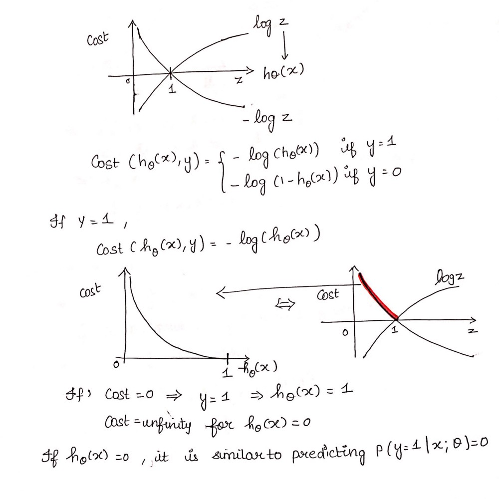

# 逻辑回归——详细概述
[点击查看原文](https://towardsdatascience.com/logistic-regression-detailed-overview-46c4da4303bc)

>逻辑回归模型(来源:http://dataaspirant.com/2017/03/02/how-logistic-regression-model-works/)

使用逻辑回归的生物科学在20世纪早期。它被用在许多社会科学应用。使用逻辑回归时,因变量(目标)分类。

例如, 　　 　　
- 预测电子邮件是否是垃圾邮件(1)或(0) 　　
- 是否肿瘤是恶性的(1)(0)

考虑这样一个场景,我们需要分类电子邮件是否是垃圾邮件。如果我们使用线性回归问题,需要设置一个阈值根据分类可以做到的。说,如果实际的类是恶性的,预测连续值0.4和阈值是0.5,点的数据将被归类为不恶性从而导致严重的后果。

从这个例子中,我们可以推断,线性回归是不适合分类问题。线性回归是无界的,这带来了逻辑回归到照片。他们的价值范围从0到1。

Simple Logistic Regression

(Full Source code: https://github.com/SSaishruthi/LogisticRegression_Vectorized_Implementation/blob/master/Logistic_Regression.ipynb)

Model

Output = 0 or 1

Hypothesis => Z = WX + B

hΘ(x) = sigmoid (Z)

Sigmoid Function


如果“Z”趋于无穷时,Y(预测)将成为1如果“Z”→负无穷,Y(预测)将变成0。

**Analysis of the hypothesis**
The output from the hypothesis is the estimated probability. This is used to infer how confident can predicted value be actual value when given an input X. Consider the below example,

X = [x0 x1] = [1 IP-Address]

基于x1值,假设我们得到估计的概率是0.8。这告诉,有80%的几率将垃圾邮件的电子邮件。

Mathematically this can be written as,


这证明了“回归”的名字。数据是符合线性回归模型,然后是受到一个逻辑函数预测目标分类因变量。

**Types of Logistic Regression**
1. Binary Logistic Regression

2分类响应只有两个可能的结果。例如:垃圾邮件

2. Multinomial Logistic Regression

三个或三个以上类别没有排序。例子:预测哪种食物是首选(蔬菜,非素食,素食)

3. Ordinal Logistic Regression

三个或三个以上类别排序。例如:电影评级从1到5

*Decision Boundary(判定边界)*
预测数据属于哪个类,可以设置一个阈值。基于这个阈值,获得的估计概率是分为类。
说,如果predicted_value≥0.5,那么其他分类电子邮件为垃圾邮件不是垃圾邮件。
决定边界可以是线性的或非线性的。多项式阶可以增加复杂的决策边界。

**Cost Function(代价函数)**


为什么代价函数被用于线性不能用于逻辑?

线性回归使用均方误差作为其成本函数。如果这是用于逻辑回归,那么这将是一个非凸函数的参数(θ)。只有在函数是凸的梯度下降法才能将收敛到全局最小。


**Cost function explanation**



**Simplified cost function(简化代价函数)**


**Why this cost function?**


这个负函数是因为当我们训练的时候,我们需要通过最小化损失函数的概率最大化。降低成本将增加最大似然假设样本都来自相同的独立分布。

**梯度下降算法的推导**


***Python Implementation***

```python
def weightInitialization(n_features):
    w = np.zeros((1,n_features))
    b = 0
    return w,b
def sigmoid_activation(result):
    final_result = 1/(1+np.exp(-result))
    return final_result

def model_optimize(w, b, X, Y):
    m = X.shape[0]
    
    #Prediction
    final_result = sigmoid_activation(np.dot(w,X.T)+b)
    Y_T = Y.T
    cost = (-1/m)*(np.sum((Y_T*np.log(final_result)) + ((1-Y_T)*(np.log(1-final_result)))))
    #
    
    #Gradient calculation
    dw = (1/m)*(np.dot(X.T, (final_result-Y.T).T))
    db = (1/m)*(np.sum(final_result-Y.T))
    
    grads = {"dw": dw, "db": db}
    
    return grads, cost
def model_predict(w, b, X, Y, learning_rate, no_iterations):
    costs = []
    for i in range(no_iterations):
        #
        grads, cost = model_optimize(w,b,X,Y)
        #
        dw = grads["dw"]
        db = grads["db"]
        #weight update
        w = w - (learning_rate * (dw.T))
        b = b - (learning_rate * db)
        #
        
        if (i % 100 == 0):
            costs.append(cost)
            #print("Cost after %i iteration is %f" %(i, cost))
    
    #final parameters
    coeff = {"w": w, "b": b}
    gradient = {"dw": dw, "db": db}
    
    return coeff, gradient, costs
def predict(final_pred, m):
    y_pred = np.zeros((1,m))
    for i in range(final_pred.shape[1]):
        if final_pred[0][i] > 0.5:
            y_pred[0][i] = 1
    return y_pred
```

**Cost vs Number_of_Iterations**

训练和测试系统的精度是100%
这个实现是二进制逻辑回归。对数据有超过2类,softmax回归必须被使用。

[点击查看完整代码](https://github.com/SSaishruthi/LogisticRegression_Vectorized_Implementation/blob/master/Logistic_Regression.ipynb)
[查看完整代码md](./Logistic_Regression.md)